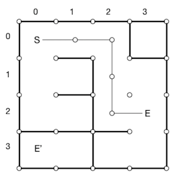
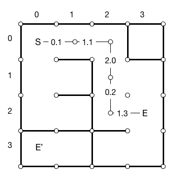
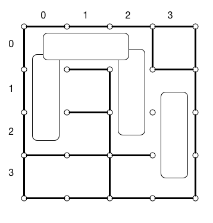

# Project 1: Maze Solver
CMSC 330, Spring 2020
Due Tuesday, February 11th (Late Wednesday, February 12th).

**This is an individual assignment. You must work on this project alone.**

### Introduction
As we saw in lecture, Ruby provides rich support for tasks that involve text processing. For this project, you'll write a Ruby program that processes text files containing maze data, and you will analyze that data to determine certain features of each maze. The goal of this project is to allow you to familiarize yourself with Ruby's built-in data structures and text processing capabilities.
### Project Files
To begin this project you will need to clone the git repository.  The command to do this is:

```bash
git clone https://github.com/anwarmamat/cmsc330spring20
```

This project is located in the `project1` folder of the repository.  The following are the relevant files:
<!-- TODO add the real files to the document and ensure that they're correct -->
- Ruby Files
    - **maze.rb**:  The main script you will be editing.  It's used to process maze files, which are text files that are passed in as arguments
    - **runner.rb**: A command line script to run your test your program.  The arguments should be as follows:
```text
ruby runner.rb <command_name> <arg1> <arg2> ...
```
Mazes and Paths
------------------
This project works with mazes, and paths through the mazes. Mazes are square grids of square cells, and an individual maze is based on the pattern of walls between adjacent cells. Paths in mazes go from a start to end cell in left, right, up and down moves cell to cell through open walls, and are blocked by closed walls. Exterior walls are always closed. 

The following maze is size 4 by 4, with integer indices 0 to 3 in x left to right, and 0 to 3 in y top to bottom. There is a path of distance 5 between start S and end E, but no path from S to alternative end E'. The path from S to E has the moves right, right, down, down, right, which can be encoded as rrddr. The distance (or length) of a path is the integer number of moves. In the project we use the terms indices and coordinates interchangably. 



Walls can have costs, or weights, to transverse, and the cost of a path is the sum of the weights along the path. In the case below the path cost is 5.7. Walls can be asymmetric, so the cost through a wall is different in one direction than another - this means that the cost of a path is directional. The cost from S to E may not be the same as E to S, although the path distance is symmetric between start and finish. In a valid maze, a wall is either open or closed from both sides.



A maze problem is a maze plus special, designated maze start and end cells. A maze problem is solvable if there is a path of open walls between the given maze start and end nodes. Part 5 of the project asks for a solution to a maze problem. 

A maze may have secondary problems, which you solve in parts 2 and 4. A maze file may have special lines, path specification lines, that define paths by a new start cell and a path given by moves. In part 2 you process these lines and compute the weighted cost of each such path. In part 4 you compute the distance from the maze start cell to all other reachable cells. 

A bridge is a special path in a maze, a sequence of two identical moves in that connect three cells. So uu, ll, rr, dd are the only possible bridge paths. Bridges can start anywhere, and can overlap (so four cells in a row represent two bridges.) This is explained again below in Part 1.




Maze File Format
------------------
Mazes are defined in text files according to the format we describe next, which we will refer to as the *simple maze data file format*.  The maze.rb we have provided includes a parser for files in this format.  In the last part of the project, you will have to write a parser for files in a different format.

The maze data files have a relatively simple structure.  Here's an example (the ellipsis ... is not part of the file, but indicates the continuation of the cell specifications.)
```text
16 0 2 13 11 
0 0 du 123.456 0.123456
0 1 uldr 43.3 5894.2341 20.0 5896.904
... 
path path1 0 2 urdl
path path2 0 2 dlr 
```
The first line in the file is the maze *header*.  It has the form:

```text
<size> <start_x> <start_y> <end_x> <end_y>
```

These fields indicate (respectively) the size of the maze and the (x,y) indices, or coordinates, for the maze start and end points used in parts 4 and 5. All mazes are square, so the size indicates both the length and the width. The integer grid coordinates start in the upper left-hand corner of the maze and increase as they move down and right. For example, in a maze of size 16, (0,0) is the upper-left corner, and (15,15) is the lower-right corner. With this coordinate system, moving *down* from a cell increases its y value, and moving *right* from a cell increases its x value. Thus going up from (5, 8) would take you to (5, 7), going down would take you to (5, 9); going left or right would respectively lead to (4, 8) and (6, 8). You may assune headers are valid, in that the start and end coordinates are inside the maze, not outside.

Unlike common mazes that one might find on paper where you enter from outside, the maze start and end cells are arbitrary cells *inside the maze*. A valid maze has no openings in the outer wall. The outer perimeter of the maze is a single, solid wall, so you needn't worry about accidentally walking through an open wall out into the space outside the maze (but a path that does go through an exterior wall is invalid in part 2).

Every line beyond the first can represent either a *cell* in the maze or a *path* through the maze. Each cell specifies where walls are (more precisely are not) in the maze, while a path is a trip through the maze defined by the cells (these paths are *not* between the maze start and end cells, but from a new start cell through a sequence of moves.) 

Lines representing *cells* take the form:

```text
<x> <y> <dirs> <weights>
```
The `dirs` part is a set of up to four "open wall" characters, (any combination of 'udlr', representing up, down, left, right), followed by up to four floating point weights (separated by spaces, and possibly negative), one per character in `dirs`. For example:
```text
4 7 lur 1.3 5.6 8.2
```
indicates that the cell at coordinates (4,7) has openings that lead left, up, and right from that cell (and thus there is a "closed wall" that prevents movement down). The characters can appear in *any* order, but may only include 'udlr', and each letter may appear at most once. Any missing characters (like the example above) means there is a "closed wall" in that direction of the cell. Similarly, if a maze specification does not mention a particular cell, then you can presume that all of that cell's walls are closed (i.e. the cell has 4 closed walls in all directions).  A cell line with no directions specified is also valid, and would indicate that no directions are passable.

The maze file format specifies that after the header, the file lists all cells in the maze in column major order, ie, in x and then in y. If any cells are omitted, they are closed in all directions.  For example, in the following example of a 2x2 maze:

```text
2 0 0 1 1
0 0 d 1.5
0 1 ur 2.0 1.0
1 1 l 1.7
```

the cell (1, 0) is not listed.  This means that it has no open walls.  This is equivalent to specifying the line without any directions:

```text
2 0 0 1 1
0 0 d 1.5
0 1 ur 2.0 1.0
1 0
1 1 l 1.7
```

Following the list of open walls for a cell specification is a list of *weights* for each wall opening. These appear in the same order as the open walls: in the example above, the left opening has weight 1.3, the up opening has weight 5.6, and the right opening has weight 8.2. We'll explain what these weights will be used for later.

After all the cells are defined, there may or may not be lines representing *paths*, or path specification lines. These take the form:

```text
path <path_name> <start x> <start y> <move 1><move 2><move 3>...
```
In the simple format, there is one path specification per line. Each path specification consists of a name, a starting (x,y) coordinate, and a list of directions (which we'll call "moves"), all concatenated together, that the path takes to reach its destination. The start coordinates are integers, and directions include the characters 'u', 'd', 'l', and 'r'. For example:

```text
path path1 0 2 uurrddll
```

The path <span style="font-family:Consolas; font-size:1.2em;">"path1"</span> starts at coordinates (0,2) and then proceeds up twice, right twice, down twice, and left twice, to reach its ending point (which happens to be the same as the starting point).  A valid path description starts inside the maze, and doesn't not lead outside or through closed walls. 

The maze.rb file we have given you will parse in the data in this format. The parser is invoked by the mode <span style="font-family:Consolas; font-size:1.2em;">print</span>, which prints its results so you can see how it has parsed the different parts of the maze. (You'll change the implementation of print before finishing the project, as described below.)

## Part 1: Find Maze Properties
The first thing your program will do, of course, is to read in the maze using the parser provided. **You may assume that maze files in the simple format, which we use in parts 1 through 5 of this project, are valid.**

Once the maze is read in, your program will compute various properties of the maze, according to the command (mode) it is given. Here are three simple properties you'll compute: the number of open cells in the maze, the number of "bridges", and the list of all cells sorted by their number of openings.

First, if we invoke your script with the mode `open`, your script should output one line listing the number of cells for which all four directions are open. For example:
```
% ruby runner.rb open inputs/maze1
2
```
The two open cells are at the second row, second and thrid column. (See the pretty-printed version of maze1, below, for a visual depiction.)

Second, if we invoke your script with the `bridge` mode, your script should output the number of vertically or horizonally open 1-by-3 locations in the maze. Bridges can overlap. For example:

```
% ruby runner.rb bridge inputs/maze1
6
```
The bridges are:

row 0, columns 0,1,2; row 1, columns 1,2,3; row 2 columns 0,1,2; column 1, row 0,1,2; column 2, row 0,1,2; and column 2, row 1,2,3. In (x,y) coordinates, the bridges are (0,1),(1,1),(2,1); (1,1),(2,1),(3,1); (0,2),(1,2)(2,2); (1,0),(1,1),(1,2); (2,0),(2,1),(2,2); (2,1),(2,2),(2,3) respectively.

Finally, if we invoke your script with the `sortcells` mode, your script should print the cells sorted by the number of openings. For example:
```
% ruby runner.rb sortcells inputs/maze1
0,(1,3),(3,0)
1,(0,0),(0,3),(3,2),(3,3)
2,(0,1),(0,2),(1,0),(2,0),(2,3),(3,1)
3,(1,2),(2,2)
4,(1,1),(2,1)
```
The output indicates that two cells (1,3) and (3,0) have no openings, four cells have one opening, etc. Cells with the same number of openings are sorted by their column, then row. This means sort by x-coordinate first, then sort by y-coordinate (i.e. lexicographic order).

If there are no cells with a certain number of openings, that line should be omitted.  For example, if there are no cells with exactly 1 opening, you should not print a line starting with `1,`.

## Part 2: Process & Sort Paths By Cost

As described in the introduction, some maze files will contain paths. Only paths that travel between cells through openings are *valid*. For each valid path, you will need to use the weights for each opening in the maze to calculate the *cost* of the path. For example, if the coordinates (in a simple maze file)
```text
path path1 0 1 drdu
```
appear in a path, and the cell at (0,1) is defined as

```text
0 1 ldr 342.54 958.1 3.126
```
the cost of the first move in the path will be 958.1 (the weight for the "d" opening). The cost of a whole path is the *sum* of the weight of each opening through which it passes. You may assume no two paths will have the same cost.

Also, recall that weights can be negative.

Once you have found which paths are valid and calculated the cost of each valid path, you need to return the cost and name of each valid path, in order of cost from lowest to highest.  If there are no paths, simply return "none".  If there are valid paths, you should return an array of strings, each being in the following format:

```text
<path total cost> <path name>
```

Note that there is exactly one space between the cost of the path and the path name.

Where `path total cost` is formatted to 4 decimal places and right-aligned in 10 characters.  The best way to format a floating-point value in this way is by doing the following:

```text
cost = 1.23456789
formatted = "%10.4f" % cost
```

This will cause `formatted` to contain the string <pre>"    1.2346"</pre>, rounded to 4 decimal places and aligned correctly.

For example, for maze "inputs/maze2", your function should return the following:

```ruby
["   99.9958 path1", "  103.7790 path2"]
```

and for "inputs/maze1", it should return:

```ruby
"none"
```

When you run your script with `runner.rb`, the outputs should look like the following:

```
% ruby runner.rb paths inputs/maze2
   99.9958 path1
  103.7790 path2

% ruby runner.rb paths inputs/maze1
none
```

Note, however, that you are should not be printing these values, but rather returning them as described above.

## Part 3: Pretty-print Maze

The textual specification of mazes makes them difficult to understand. For this part of the assignment, you'll implement a "pretty-printing" function for mazes. Your pretty print format will use the following conventions:

- Each cell will be represented by either a space, the letter "s" (for the start cell), or the letter "e" (for the end cell).
- Left/right walls will be represented by a pipe character "|", up/down walls will be represented by a dash "-", and wall junctions will be represented with a plus "+".
- If the maze file contains paths, print asterics in the cells on the shortest (as defined in Part 2 above) path. If the shortest path includes the start cell or end cell, print capital letter "S" or "E" instead of "s" or "e".

Your program will print a maze in this format when executed with the `print` command.

Here is an example maze that starts at (0,0) and ends at (3,3):
```
% ruby runner.rb print inputs/maze1
+-+-+-+-+
|s|   | |
+ + + +-+
|       |
+-+ + + +
|     | |
+ +-+ +-+
| | |  e|
+-+-+-+-+

ruby runner.rb print inputs/maze2
+-+-+-+-+
|E|   | |
+ + + +-+
|* *    |
+-+ + + +
|* *  | |
+ +-+ +-+
|S| |   |
+-+-+-+-+

ruby runner.rb print inputs/maze3
+-+-+-+-+
| |   | |
+ + + +-+
|       |
+-+ + + +
|* * *| |
+ +-+ +-+
|S|e|* *|
+-+-+-+-+
```
In maze2, the shortest path includes the start and end cells. In maze3, the shortest path includes the start cell, but does not include the end cell.
Note: You are given a function that parses and prints a simple maze file. You will need to change the "print" case to your own function that will "pretty-print" the maze.

## Part 4: Find Distance of Cells From Start

Next, you need to analyze all the openings in a maze to determine the *distance* of all cells reachable from the start of the maze. As said earlier in this readme, we define distance between two cells a and b to be the number of up/down/left/right cell openings that are passed through when traveling from a to b. If there are multiple paths from a to b, the path with the shortest distance is the distance between a and b. The distance of the start cell from itself is always 0. If there is no valid path from a to b (i.e. b is not reachable from a) then the distance from a to b is undefined.

Once you have calculated the distance for all cells reachable from the start cell, print out the results in order of increasing distance. On each line, print out the distance d, followed by all cells reachable from the start cell for that distance d. Cells should be printed as (x,y) coordinates in lexicographic order (as defined by `sortcells` in **Part 2**), separated by commas. Note that the first line will always be distance 0, followed by the location of the starting point of the maze.
```text
% ruby runner.rb distance inputs/maze2
0,(0,3)
1,(0,2)
2,(1,2)
3,(1,1),(2,2)
4,(0,1),(1,0),(2,1),(2,3)
5,(0,0),(2,0),(3,1),(3,3)
6,(3,2)
```

## Part 5: Decide Whether Maze Problem is Solvable

Now use your script to determine whether or not a maze can be solved. You can do this by implementing a new algorithm to compute a path from the maze start to the maze end (that appear in the maze header), or by using the cell distances calculated previously in Part 4 to see if one of the valid distances is from the start to end. 

You do *not* need to return a path representing a solution from start to finish. Your program will only need to indicate whether a path *exists* by printing "true" when a maze can be solved and "false" otherwise.
```
% ruby runner.rb solve maze1
true
```

## Hints and Tips
- This project is non-trivial, in part because you will probably be writing in Ruby for the first time, so be sure to start right away, and come to office hours if you get stuck.
- Follow good program development practices: Test each part of your program as you develop it. Start developing a simplified solution and then add features as you are sure that earlier parts work. Test early and often, and re-run your tests as you add new features to be sure you didn't break anything.
- Before you get too far, review the Ruby class reference, and look for classes and methods that might be helpful. For example, the Array and Hash classes will come in handy. Finding the right class might save you a lot of time and make your program easier to develop.
- Beware: iterating over hash mappings is not guaranteed to happen in a particular order.
- If you write methods that should return a true or false value, remember that a Ruby 0 is not false.
- Ruby has an integrated debugger, which can be invoked by running Ruby with the -rdebug option. The debugger's p command may be helpful for viewing the values of variables and data structures. The var local command prints all of the local variables at the current point of exclusion. The chapter When Trouble Strikes of The Pragmatic Programmer's Guide discusses the debugger in more detail.
- To thoroughly debug your program, you will need to construct test cases of your own, based on the project description. If you need help with this, please come to TA office hours.
- Remember to save your work frequently---a power failure, network failure, or problem with a phone connection could cost many hours of lost work. For the same reason, submit your project often. You can retrieve previously-submitted versions of your program from the submit server should disaster strike.
- Be sure you have read and understand the project grading policies in the course syllabus. Do this well in advance of the project due date.


Project Submission
------------------
You should submit a file `maze.rb` containing your solution. You may submit other files, but they will be ignored during grading. We will run your solution as MiniTest test units, just as in the provided public test file.

Be sure to follow the project description exactly! Your solution will be graded automatically, so any deviation from the specification will result in lost points.

You can submit your `maze.rb` file directly Gradescope.

Use the submit dialog to submit your `maze.rb` file directly. Select your file using the "Browse" button, then press the "Submit project!" button. You **do not** need to put it in a zip file.

No matter how you choose to submit your project, make sure that your submission is received by checking the results after submitting.

Academic Integrity
------------------
Please **carefully read** the academic honesty section of the course syllabus. **Any evidence** of impermissible cooperation on projects, use of disallowed materials or resources, or unauthorized use of computer accounts, **will be** submitted to the Student Honor Council, which could result in an XF for the course, or suspension or expulsion from the University. Be sure you understand what you are and what you are not permitted to do in regards to academic integrity when it comes to project assignments. These policies apply to all students, and the Student Honor Council does not consider lack of knowledge of the policies to be a defense for violating them. Full information is found in the course syllabus, which you should review before starting.

<!-- Link References -->

<!-- TODO: Add actual cloning directions -->
[cloning instructions]: ../git_cheatsheet.md
